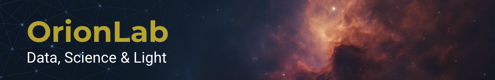

# Hugo Baghetti Calderón  
**Ingeniero en Informática | Astrofotógrafo | Investigador OrionLab (2019–2026)**  
Chile | Astro & Data Science | Neurodata | Ingeniería y Sistemas

---

## 🌌 Investigación Científica y Tecnología (2019–2026)
OrionLab es mi laboratorio personal de investigación donde desarrollo estudios sobre:

- Astrofotografía científica y óptima (ruido térmico, filtros, SNR, apilamiento, dithering)
- Visibilidad astronómica desde el hemisferio sur
- Modelos de cielo profundo y análisis cuantitativo
- NEURODATA: Interpretación de señales EEG, BCI y correlatos de dolor/estrés
- Pipelines Python para simulación, reducción y análisis astronómico

🔭 **Repositorio de investigación:**  
➡️ https://github.com/teleobjetivo/orionlab-research

---

## 📂 Portafolio Técnico – Ingeniería y Análisis
Set de proyectos en Data analytics y transformación digital:

- Arquitectura de datos  
- Integración y automatización  
- Modelos analíticos  
- Dashboards y reporting técnico  
- Python & SQL aplicado a problemas reales de negocio

📘 **Repositorio técnico:**  
➡️ https://github.com/teleobjetivo/analytics-tech-portfolio

---
### ⚙️ Observable Control Rooms Suite (2024–2025)
Suite de **micro-aplicaciones desacopladas** que simulan **centros de control operacionales modernos**,
basados en **artefactos persistentes (JSON snapshots)** en lugar de acoplamientos directos.

**Principios clave:**
- Microservicios sin dependencias duras
- Comunicación por estado observable
- Normalización, consolidación y explicación
- Separación estricta entre generación, análisis y visualización

**Incluye:**
- Anomaly Radar Control (detección explicable)
- Decision Intelligence Live (simulación y policy impact)
- Executive Report Factory (reporting automático)
- Ops Cell Lite (operación liviana y validación rápida)

📦 **Repositorio técnico:**  
➡️ https://github.com/teleobjetivo/observable-control-rooms-suite

> Estos proyectos modelan escenarios reales de **banca, retail, operación TI y analítica ejecutiva**,
permitiendo discutir arquitectura, ML aplicado y decisiones técnicas con profundidad.

---
## 🤖 ML Operational Intelligence — Machine Learning aplicado a operación (V1)
Repositorio con **14 proyectos ejecutables (V1)** orientados a: detección temprana de eventos, scoring dinámico, clasificación operacional, predicción de timelines, monitoreo de drift, dashboards ejecutivos y orquestación “alert-to-action”.

📌 **Repositorio (ML / AI):**  
➡️ https://github.com/teleobjetivo/ml-operational-intelligence

---

## 🎯 Enfoque Profesional
Mi trabajo une **método científico, ingeniería aplicada y narrativa visual**.  
Creo en resolver problemas complejos con claridad, datos y simplicidad operacional.

**Áreas clave de especialización:**

- Python para ciencia y automatización  
- Sistemas, integración y performance  
- Astronomía observacional + fotografía  
- Análisis de señales EEG y modelos BCI  
- Diseño de pipelines y simuladores  
- Gestión de proyectos y TI  

---

## 🧠 NEURODATA – Proyecto 2025–2026
Investigación aplicada para analizar señales cerebrales (EEG) y construir prototipos funcionales de:

- Identificación de estímulos asociados a dolor/estrés  
- Modelos predictivos con Python  
- Control de motores vía Arduino a través de señales EEG  
- Visualización científica de series temporales  

---

## 📸 Technical Inventory & Optical Specifications

Inventario profesional de equipos ópticos y tecnológicos utilizados en astrofotografía, fotografía científica, paisaje nocturno, imaging aéreo y registros especializados.

---

### I. 🎞️ Professional Photography (Still & Landscape)

Enfoque en adquisición de alta fidelidad, versatilidad focal y capacidades macro especializadas.

- **📷 Cámara Principal**: *Nikon D7500* (APS-C / DX-Format DSLR)  
- **📷 Cuerpo Secundario / Legacy**: *Nikon D40X* (10.2 MP DX-Format)

**🔍 Ópticas Ultra-Angulares y Primes:**

- Tokina 11–16mm f/2.8 AT-X Pro DX II *(ultra-angular para astropaisajes)*  
- AF-S Nikkor 35mm f/1.8G DX *(alta apertura para fotografía nocturna)*

**🔁 Zooms Estándar y Versátiles:**

- AF-S Nikkor 18–140mm f/3.5–5.6G ED VR *(zoom estabilizado de uso general)*  
- AF-S Nikkor 18–55mm f/3.5–5.6G II ED DX *(zoom compacto, ligero)*

**🔭 Teleobjetivos y Largo Alcance:**

- Sigma 150–600mm f/5–6.3 Contemporary *(superteleobjetivo de alto rendimiento)*  
- AF-P Nikkor 70–300mm f/4.5–6.3G ED VR DX *(telefoto rápido, motor silencioso)*  
- Vivitar Series 1 100–400mm f/4.5–6.7 AF *(zoom extendido económico)*

**🔬 Macro & Fotografía de Aproximación:**

- Meike Digital Macro Extension Tube Set *(N-AF: 12mm, 20mm, 36mm para macro sin pérdida óptica)*

---

### II. 🚁 Aerial Imaging & Drone Filtration

Captura aérea de alta resolución, control espectral, y documentación visual de estaciones astronómicas y contextos geográficos.

#### 📦 Plataforma Aérea Principal

- **DJI Mini 4 Pro Fly More Combo**
  - Sensor CMOS de 1/1.3" (f/1.7), hasta 48 MP, video 4K/100fps, RAW + 10-bit D-Log M  
  - Sistema de detección de obstáculos omnidireccional (OcuSync 4.0)  
  - Modos automatizados: *Waypoint Flight, Night Shots, Hyperlapse, ActiveTrack 360*  
  - Baterías extendidas incluidas en el combo Fly More  
  - Ideal para paisajes astronómicos elevados, scouting de ubicaciones y registros ortofotográficos  

#### 🔬 Suite de Filtración Óptica

- **Neewer Professional Optical Filtration Suite**
  - Filtros ND: ND8, ND16, ND32, ND64, ND128, ND256 *(gestión de exposición aérea)*  
  - CPL (Polarizador Circular) y UV *(reducción de reflejos y neblina atmosférica)*

---

### III. 🌕 Lunar & Planetary Astrophotography

Sistema optimizado para observación visual y seguimiento automatizado de objetos brillantes.

- **OTA**: *Celestron 114 LCM*  
  *(Reflector Newtoniano – 114mm apertura, 1000mm focal, f/8.77)*

- **Montura & Soporte**: *Celestron LCM GoTo Altazimuth Mount*  
  *(Sistema GoTo computarizado, seguimiento automatizado, base de datos astronómica)*

- **Trípode Integrado**: Aluminio ajustable con bandeja de accesorios  
- **Filtrado**: Kit de filtros planetarios y lunares (rojo, amarillo y espectrales múltiples)

---

### IV. 🌌 Deep Sky Professional Imaging Train

Sistema automatizado de alta precisión para cielo profundo (nebulosas, cúmulos, galaxias).

- **Óptica Principal**: *William Optics RedCat 51 MK2.5*  
  *(Refractor Petzval, f/4.9, 250mm – campo amplio corregido para astrofotografía)*

- **Sensor de Imagen**: *ZWO ASI533MC Pro*  
  *(CMOS refrigerado, 14-bit ADC, sin amp-glow, alto rango dinámico)*

- **Controlador & Secuenciador**: *ZWO ASIAIR Plus (2024, 256GB)*  
  *(Control completo de la sesión: GoTo, polar alignment, platesolving, autoguiado, dithering, captura automatizada)*

- **Sistema de Guiado Activo:**
  - *Telescopio Guía*: ZWO 30mm f/4 Mini Guide Scope  
  - *Cámara de Guiado*: ZWO ASI120MM Mini (monocromática)

- **Montura Ecuatorial**: *Sky-Watcher Star Adventurer GTi*  
  *(GoTo con doble eje, guiado ST4 compatible, SynScan App, portátil y precisa)*

- **Filtrado Óptico:**
  - *Optolong L-Pro 2”* (filtro broadband con supresión de contaminación lumínica)  
  - *Evaluación futura*: Filtros narrowband (Hα, OIII, SII) para cielos urbanos

- **Alimentación y Estabilidad:**
  - *Celestron PowerTank Lithium Pro* (batería de litio de alta capacidad y voltaje estable)  
  - *Trípode de carbono Leofoto* con base esférica nivelante (portabilidad + estabilidad)

---

### 🧠 Workflow & Repositorios

📂 **Captura, reducción y procesamiento científico**:  
➡️ [https://github.com/teleobjetivo/orionlab-research](https://github.com/teleobjetivo/orionlab-research)

---

## 🛠 Stack Tecnológico  
**Lenguajes:** Python, SQL, Bash  
**IA / Ciencia:** NumPy, SciPy, AstroPy, Jupyter, Matplotlib, Scikit-learn  
**DevOps / Repo:** GitHub, GitLab CI/CD  
**Instrumentos:** Nikon | ZWO | Sky-Watcher | Arduino  
**Plataformas:** macOS, AWS, Databricks  

---

## 📬 Contacto  
📧 **teleobjetivo.boutique@gmail.com**  
🌐 **www.teleobjetivo.cl**  
📷 **Instagram: @tele.objetivo**

---
> _"Explorar, medir, comprender. La ciencia es luz, y la fotografía es su eco."_  
— Hugo Baghetti Calderón
